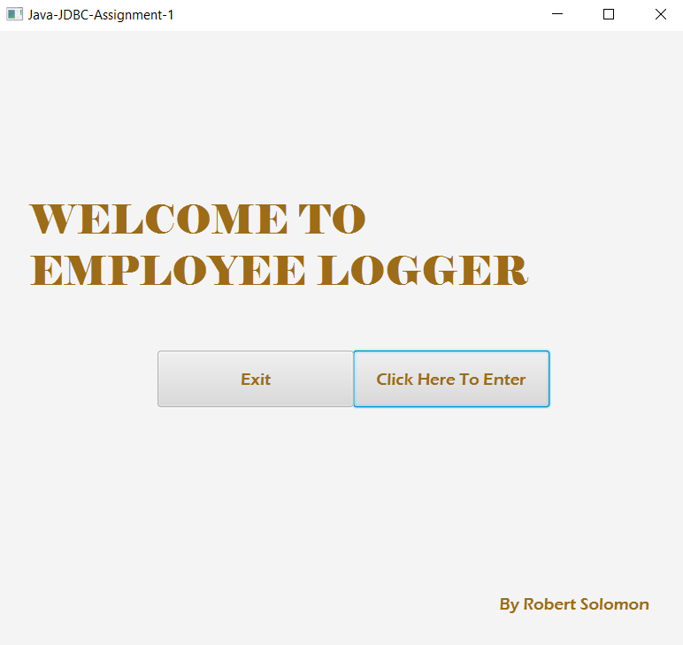
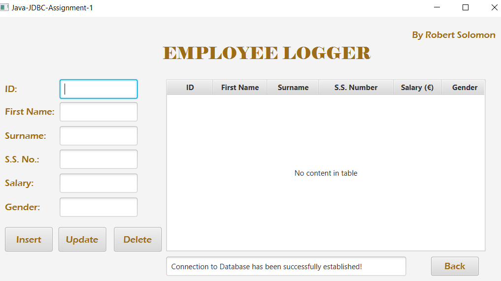
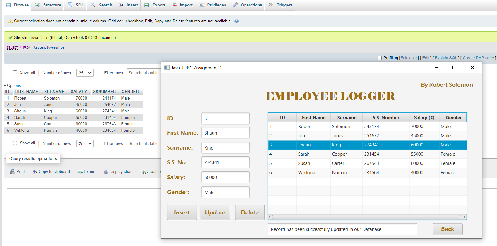

# Employee-Logger
An Information Logging Application System with C.R.U.D. Functionality connected to a PhP WampServer with MySQL.

The goal of this Project was to develop a three-tiered Apache, MySQL service Application to demonstrate web and database connectivity using Java and JDBC. (For my Distributed Systems Assignment)
 
 - I developed my database using WAMP to provide a data source to allow my Java Project to perform SQL C.R.U.D. functionalities and Query operations from within my Java Application. You can have a preview my project in the images below. 
 
 
 

 
 

  

 # Steps To Consider To Get The Project Running:
 
 - 1. Install JavaFx if you don't have it by clicking help in eclipse > install new software > Add the following link in the URL located [here](https://download.eclipse.org/efxclipse/updates-released/1.2.0/site/) to install e(fx)clipse support.  

 - 2. Download the JavaFx SDK v.15 by clicking this link [here](https://gluonhq.com/download/javafx-15-sdk-windows/)

 - 3. Configure the SDK to your Library by taking the following steps:

   Go to Windows > Preferences > Java > Build Path > User Libraries > New > Give it a Name > Add External JARs > Open your JAR Files located in your SDK lib folder and add it to your project   library.

 - 4. Next configure the Run Configuration and add the path to your sdk lib folder in the VM arguments section (in double quotations) as the following:

   --module-path "path to your sdk lib folder directory" --add-modules javafx.controls,javafx.fxml --add-modules javafx.controls,javafx.fxml

 - However if you already have JDK 15 or a standard JDK with JavaFx support then there's no need to follow the steps mentioned above.
 
 
   Should you have any problems, don't hesitate to contact me on my email at:  [robertsolomon12@outlook.com](mailto:robertsolomon12@outlook.com)
 or if you find a bug  [open up an issue here](https://github.com/robert-solomon12/Employee-Database/issues)

# Enjoy!!
